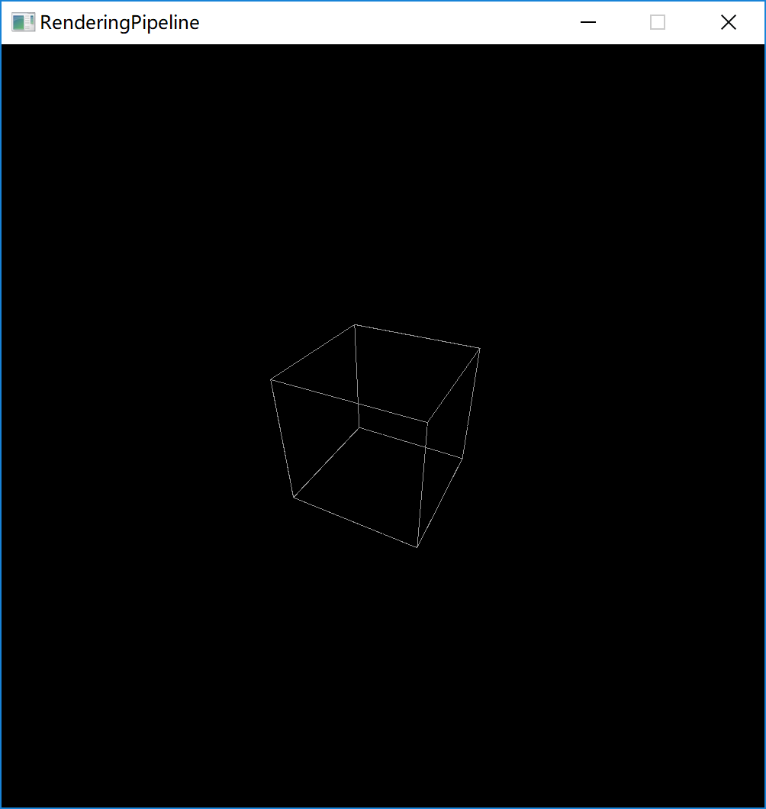
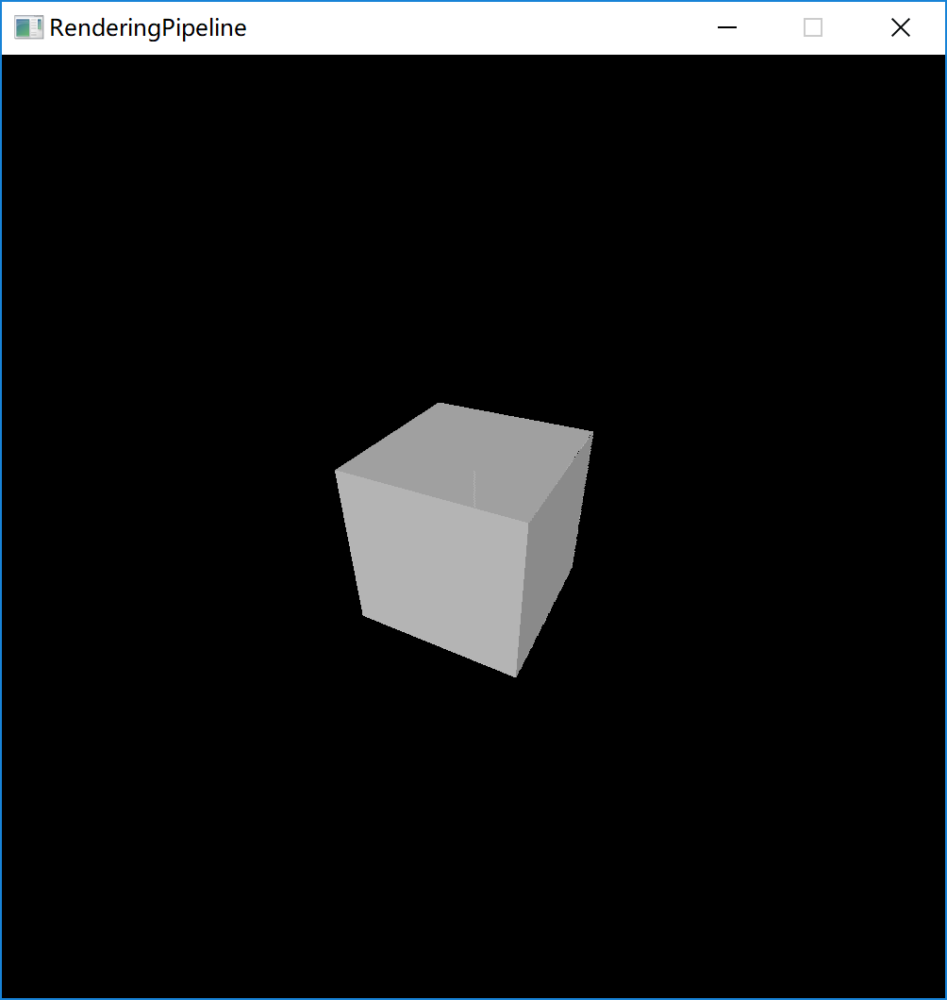

# 简介

一个C++写的渲染管线，通过像素点绘制的方式，实现线框、填充、纹理的显示。给定局部坐标，可以转换到世界坐标、在转换到相机坐标，通过透视投影的方式显示到屏幕上。

界面基于Qt5.9，开发平台是Visual Studio 2017

该软件理论上可以绘制任意平面构成的空间立体，实现了环境光和Lambert散射光照模型，也可以扩展接口实现更加复杂的光照。

平面画线使用DDA算法，有相关接口，可以拓展其他的算法。

本项目的转换矩阵是分开的，即先进性局部转换到世界的矩阵变换，然后是世界到相机，最后是相机到投影平面。如果需要可以自己改造一下，先进行矩阵乘法，然后统一转换。

裁剪算法在底部还有一个bug，导致图形裁剪不规则，需要后续的修正。

存在一些小的bug，留作后续修正，主要是屏幕中心线的地方有一条黑线，这是渲染时候的浮点数误差，但是没找到彻底的解决方案。

# 使用方式

win run文件夹中直接双击运行即可。暂时没有Mac和Linux版本的，可以自行编译。旋转的正方向是从轴的负方向看向正方向时，顺时针方向。

空格：切换显示模式

Q W E R T Y 是物体平移的，3个轴总共6个方向

A S D F G H 是物体坐标系旋转的，3个轴总共6个旋转

Z X C V B N 是移动摄像机的，暂时只定义了摄像机平移 

线框模式：

填充模式：

纹理贴图模式：

# 关于测试

留出了基本的单元测试接口，可以实际进行测试。数学库部分经过了严格的单元测试。但是其他模块由于精力有限，无法进行全面的测试了。尤其是裁剪的地方，需要更加严格的测试。
